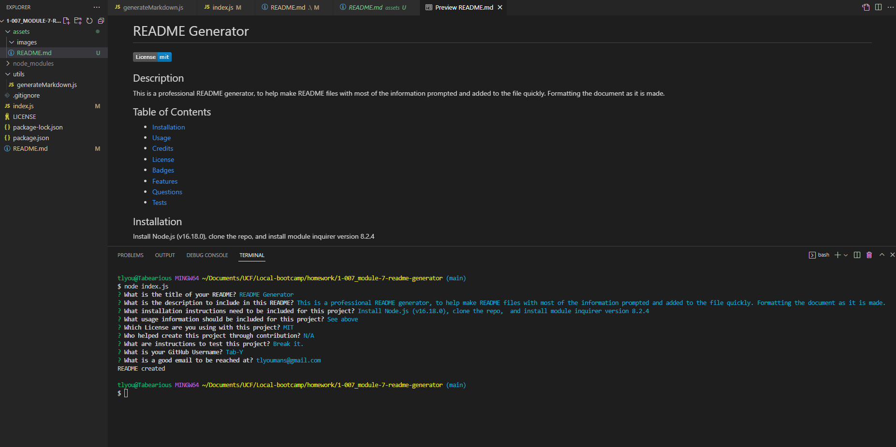

# README Generator

## Description

This is a professional README generator, to expedite the formatting and filling in information for a README file.
It was created to help create README files with a professional structure that can be editted to add fine details after it is made.

## Installation

Install Node.js
Install the NPM module inquirer version 8.2.4,

## Usage

To use this project: 
1. Make sure Node.js is installed. (made in v16.18.0)
    ```
    node -v
2. Clone to local repo.
3. Install inquirer version 8.2.4.
    ``` 
    npm install inquirer@8.2.4
4. run the program
    ```
    node index.js
5. Answer prompts
6. README is generated into assets folder


[](https://app.castify.com/view/cfa81440-a9e6-425b-9017-c23c9c08dc29) "Click on screenshot to view walkthrough video"


## Credits

N/A

## License

See license in repo

